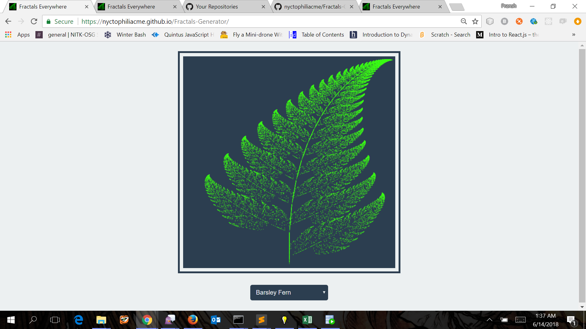
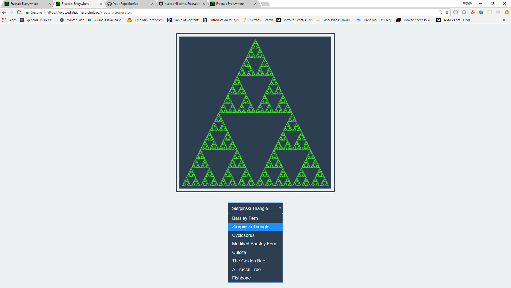
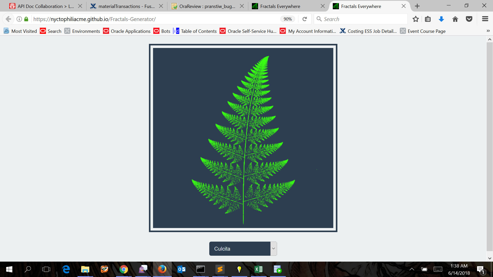
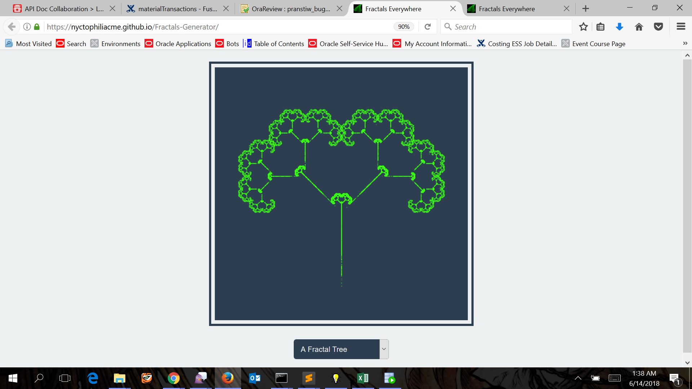
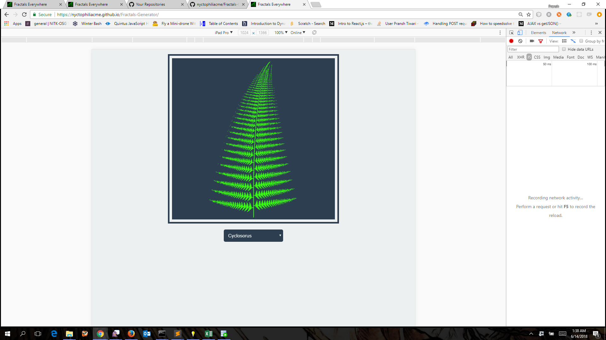

# Fractals Generator
A webpage hosted here: https://nyctophiliacme.github.io/Fractals-Generator/ demonstrating how real life patterns like ferns, trees etc can be generated using probability functions.

### Screenshots

|  |  |
| --- | --- |
| | |
| | |
| | |

